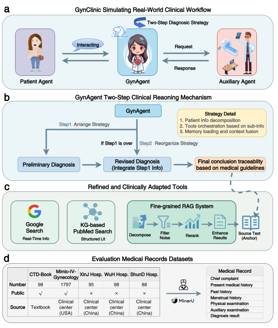
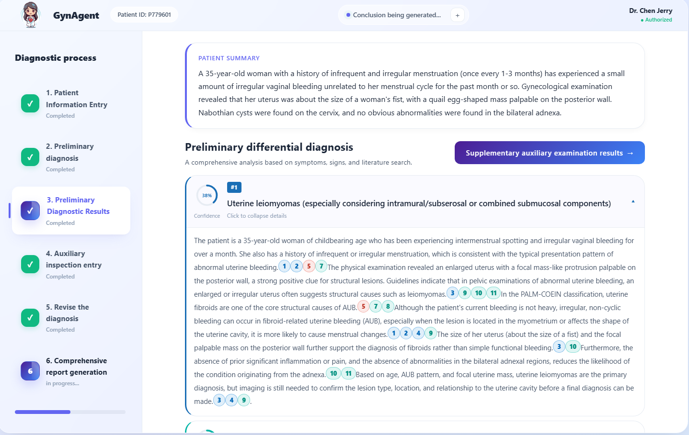

<h1>GynClinic</h1>

**The Official Repository** *Development and Validation of a Traceable Reasoning Multi-Agent Framework for Simulating Real-World Gynecological Clinical Diagnosis* 


[](https://opensource.org/licenses/MIT) [](https://www.python.org/downloads/)

---

## Overview
- **Multi-Agent Simulating Real-World Gynecological Clinical Diagnosis**
- **GynAgent Two-Stage Clinical Reasoning Mechanism**
- **Refined and Clinically Adapted Tools**
- **Traceable reasoning based on authoritative medical guidelines**


## Architecture

<p>
  
</p>


## System
**We launched our system online. Welcome visit: http://www.gynclinic.tech**

<p>
  
</p>


## Tech Stack

| Component              | Technology                                        |
|------------------------|---------------------------------------------------|
| **LLM**                | OpenAI GPT-5-mini (Default model)                 |
| **Agent Framework**    | LlamaIndex (FunctionCallingAgent)                 | 
| **RAG Framework**      | DSPy                                              |
| **Vector Database**    | ChromaDB                                          |
| **Embeddings**         | OpenAI `text-embedding-3-large`                   |
| **Reranking**          | Cohere `rerank-english-v3.0`                      |
| **Citation Checking**  | DSPy ChainOfThought                               |
| **External Tools**     | Google Custom Search API, PubMed                  |


## Project Document Introduction

```
GynClinic/
├── .env                          # API keys (OpenAI, Cohere, Google)
├── LICENSE                       # MIT License
├── requirements.txt              # Python dependencies
├── README.md
└── src/
    ├── 0run.py                   # Main entry: single-threaded pipeline
    ├── 0LLM_duibi_thread.py      # Main entry: multi-threaded pipeline
    ├── med_agent.py              # MedOpenAIAgent (Doctor Diagnosis Agent)
    ├── rag.py                    # RAG pipeline (retrieval, rerank, generation)
    ├── rag_config.py             # RAG configuration (models, chunking, etc.)
    ├── signatures.py             # DSPy signatures (Search, Answer, Citations)
    ├── agent_tools.py            # Tool definitions (Google, PubMed, Exams)
    ├── get_mytools.py            # Tool selector utility
    ├── chroma_db_retriever.py    # ChromaDB retriever (DSPy-compatible)
    ├── citations_utils.py        # Citation creation & faithfulness checking
    ├── embed.py                  # Embedding script for knowledge base
    ├── preprocess_sources.py     # Data preprocessing (add source IDs)
    ├── rag_utils.py              # RAG utility functions
    ├── utils.py                  # General utilities
    ├── loguru_logger.py          # Logging configuration
    ├── rag_logger.py             # RAG-specific logging
    ├── preprocess_logger.py      # Preprocessing logging
    ├── Imaging/
    │   └── data.json             # Patient case data (input)
    ├── complete_oncology_data/
    │   └── meditron.jsonl        # Medical knowledge base (JSONL)
    ├── process_data/
    │   ├── deduplicate_data.py   # Data deduplication
    │   ├── filter_data_sources.py # Data source filtering
    │   └── scrape_meditron.py    # Knowledge base scraping
    └── results/                  # Output directory
        ├── dp_history/           # Doctor-patient dialogue logs
        ├── rag_results/          # RAG retrieval results
        ├── tool_results/         # Tool execution results
        ├── examinations/         # Examination results
        └── reference/            # Reference documents
```

## Installation

### Prerequisites

- Python 3.11.7
- [ChromaDB](https://docs.trychroma.com/) server running locally
- API keys for OpenAI, Cohere, and Google Custom Search

### Setup

1. **Clone the repository**

   ```bash
   git clone https://github.com/chenyu202109/GynClinic.git
   cd GynClinic
   ```

2. **Create environment and Install dependencies**

   ```bash
   conda create -n gynclinic python=3.11.7
   conda activate gynclinic
   pip install -r requirements.txt --no-dependencies
   ```
    `If you encounter dependency installation issues or any other problems, please contact me and I will package this project dependency for you.`
3. **Configure environment variables**

   Copy the `.env` file and fill in your API keys:

   ```env
   OPENAI_BASE_URL="your-openai-base-url"
   OPENAI_API_BASE="your-openai-api-base"
   OPENAI_API_KEY="your-openai-api-key"
   COHERE_API_KEY="your-cohere-api-key"
   GOOGLE_API_KEY="your-google-api-key"
   GOOGLE_SEARCH_ENGINE="your-google-search-engine-id"
   ```
   https://platform.openai.com/account/api-keys \
   https://dashboard.cohere.com/welcome/register \
   https://developers.google.com/custom-search/v1/introduction?hl=de 

   
4. **Start ChromaDB server**

   ```bash
   chroma run --path ./src/chroma_db_oncology
   ```

5. **Build the knowledge base**

   Download the medical knowledge base we have organized and place it in the directory `complete_oncology_data`
   https://huggingface.co/datasets/chenyu202109/Agent_RAG_Dataset
   
   ```bash
   cd src
   # Create embeddings and index
   python embed.py --to_embed meditron
   ```

## Usage

### Before Run 
open this file: `envs\gynclinic\Lib\site-packages\llama_index\llms\openai\utils.py`
add model： `"gpt-5-mini-2025-08-07": 400000,`

### Run the GynAgent Diagnostic Pipeline

```bash
cd src
python 0run.py
```

1. Load patient cases from `Imaging/data.json`
2. For each patient, execute the full diagnostic workflow (interview → summary → preliminary diagnosis → auxiliary exams → revised diagnosis)
3. Save results to `Imaging/result.json`
4. Run records in the results directory

### Run Baselines

```bash
cd src
python 0LLM_duibi_thread.py
```

### Patient Data Format

Patient cases are stored in JSON format (`Imaging/data.json`):

```json
{
    "patient_id": "W-2",
    "basic_msg": "**Basic information**: Female, 28 years old, system ID is W-2",
    "context_msg": "**Basic information**: ... **Chief complaint**: ... **Medical history**: ...",
    "physical_examination": "**Physical examination**: ...",
    "check_report": {
        "Vaginal pH": "> 6",
        ...
    },
    "groud_truth": ["Trichomonas Vaginitis"]
}
```
If batch testing data is required, please download https://huggingface.co/datasets/chenyu202109/CDT-Book Then replace the `Imaging/data.json`.

## License

This project is licensed under the [MIT License](LICENSE).

## Acknowledgments

This project builds upon and adapts code from the following open-source projects:

- [LlamaIndex](https://github.com/run-llama/llama_index) — Agent framework (MIT License)
- [DSPy](https://github.com/stanfordnlp/dspy) — RAG pipeline and citation checking (MIT License)
- [ChromaDB](https://github.com/chroma-core/chroma) — Vector database